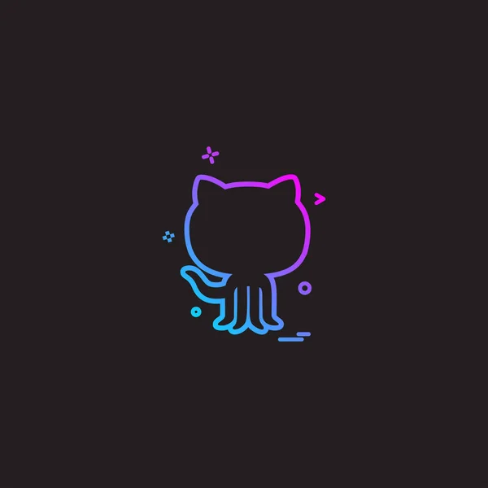

<!-- Animated Header with Gradient -->
<div align="center">

# 🌊 Welcome to My Digital Universe



<!-- Animated Typing Effect -->


</div>

---

## 🎯 **About Me - The Digital Craftsman**

<div align="center">

<table border="0">
<tr>
<td width="55%" valign="top">

### 💫 **Current Focus**

```yaml
name: Martin Jimenez
role: Software Engineer
experience: Building web, mobile, and backend projects
specialization:
  web:
    - TypeScript
    - JavaScript
    - Ecommerce applications
  mobile:
    - Kotlin
    - Android development
  interests:
    - Soccer
    - Freestyle
```

### 🎨 **Philosophy**

> *"Code is poetry written in logic"*
>
> Building experiences that matter, one project at a time

### 📬 **Let's Connect**

📧 **Email:** mar45pillacela@gmail.com  
💻 **GitHub:** [@martinizin](https://github.com/martinizin)  
⚽ **Fun Fact:** I am addicted to soccer and freestyle

</td>
<td width="45%" align="center" valign="middle">


<br/><br/>


</td>
</tr>
</table>

</div>


---

## 🌐 **Social Networks**

<div align="center">

[](https://facebook.com/MartinJimenez)
[](https://instagram.com/martiinizin)
[](https://linkedin.com/in/MartinJimenez)
[](https://twitter.com/martiinizin)
[](https://youtube.com/@Martin)

</div>


---

## 🌈 **Arsenal of Technologies**

<div align="center">

### **Web Development**


### **Mobile Development**


### **Tools & Platforms**


</div>


---

## 🎨 **Featured Projects - Portfolio Highlights**

<div align="center">

<table>
<tr>
<td width="50%">

### 🛒 **Ecommerce Frontend**
*Ecommerce system*

🔗 [Repository](https://github.com/martinizin/ecommerce-frontend)

**Tech:** TypeScript

✨ A public ecommerce project built for a modern web experience.

</td>
<td width="50%">

### 🐾 **Vet FullStack**
*Veterinary API*

🔗 [Repository](https://github.com/martinizin/vetFullStack)

**Tech:** JavaScript

✨ A full-stack veterinary project and API.

</td>
</tr>
<tr>
<td width="50%">

### 📝 **Blog AM**
*Mobile applications project*

🔗 [Repository](https://github.com/martinizin/blogAM)

**Tech:** TypeScript

✨ A project developed for mobile applications coursework.

</td>
<td width="50%">

### 🧮 **Calculadora App**
*Android calculator*

🔗 [Repository](https://github.com/martinizin/calculadoraApp)

**Tech:** Kotlin

✨ Calculator with basic functions and three trigonometric functions.

</td>
</tr>
</table>

</div>


---

## 📊 **GitHub Analytics**

<div align="center">


<br/><br/>


<br/>


</div>


---

## 🏆 **Achievements Unlocked**

<div align="center">


</div>

---

<div align="center">

## 💡 **Developer Wisdom**


<br/><br/>


<br/><br/>


</div>
